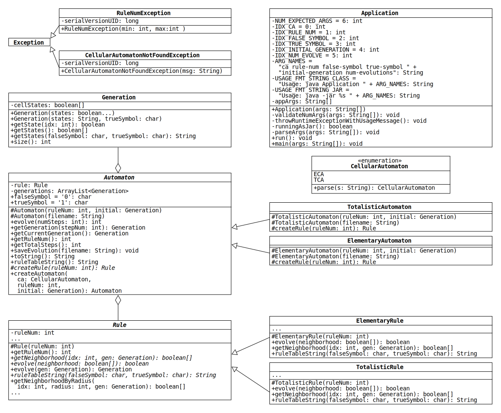

# Project 2: Not-So-Elementary Cellular Automata

> The key to maximizing reuse lies in anticipating new requirements and changes to existing requirements...
> To design a system so that it's robust to such changes, you must consider how the system might need to change over its lifetime.
> A design that doesn't take change into account risks major redesign in the future.
>
> &mdash;Gang of Four, in [*Design Patterns: Elements of Reusable Object-Oriented Software*](https://en.wikipedia.org/wiki/Design_Patterns)

## Introduction

In Project 1, we wrote three classes to simulate the evolution of [elementary cellular automata](https://en.wikipedia.org/wiki/Elementary_cellular_automaton).
The goal of this project is to simulate a second type of one-dimensional, two-state cellular automaton while writing a minimal amount of new code and avoiding duplicate code.
In the process, we will modify our Project 1 classes to make it possible to simulate even more types of cellular automata in the future without changing our Project 2 code.
In addition, we will write an Application class to implement a command-line application that simulates cellular automata using our classes.

## Overview

A UML diagram of the classes is shown below.
To view a larger version, open the file [uml.pdf](./uml.pdf) in a PDF reader.



As in Project 1, Automaton uses an ArrayList of Generations and a Rule to simulate a one-dimensional (1D), two-state cellular automaton (CA).
However, Automaton and Rule are now abstract (denoted in the UML diagram with *italics*) and have the following abstract methods (also *italicized*):

* `createRule(int ruleNum)`
* `getNeighborhood(int idx, Generation gen)`
* `evolve(boolean[] neighborhood)`
* `ruleTableString(char falseSymbol, char trueSymbol)`

Two of these methods, `getNeighborhood(int, Generation)` and `evolve(boolean[])`, were in Project 1 and contained code that was specific to elementary CAs.
This code has been moved to a new class, ElementaryRule, that inherits from Rule.
A second Rule subclass, TotalisticRule, has also been created that simulates a different type of 1D, two-state CA.

To make Automaton compatible with both ElementaryRule and TotalisticRule, the class now uses `createRule(int)` to instantiate Rule objects, rather than calling a Rule subclass constructor with the `new` keyword.
Each subclass of Automaton overrides `createRule(int)` to make it return an object of the corresponding Rule subclass: ElementaryRule for ElementaryAutomaton and TotalisticRule for TotalisticAutomaton.

Additional information about the classes is given in the following sections.

## Generation

This class is unchanged from Project 1.
It represents the cells of a 1D, two-state CA at a single moment in time.

## Rule

The abstract Rule class represents any rule that governs the evolution of a 1D, two-state CA.<sup id="a1">[1](#f1)</sup>
The behavior of different rule types (e.g., elementary, totalistic) is simulated by extending the class and overriding two methods:

* `getNeighborhood(int idx, Generation gen)`: Return the cell states in the neighborhood of the cell with the given index.

* `evolve(boolean[] neighborhood)`: Return the next state of a cell in a neighborhood with the given states.

Subclasses of Rule must also override a method that returns a string representation of a Rule object:

* `ruleTableString(char falseSymbol, char trueSymbol)`: Return the table that depicts the rule using the given characters to represent false and true.

In addition, there is now a public helper method:

* `getNeighborhoodByRadius(int idx, int radius, Generation gen)`: Return the cell states in the neighborhood of the cell with the given index and specified radius. The radius refers to the additional number of cells to the left/right of the given index. 
  * A radius of one is three cells:
    ```
    [cellStates[idx-1], cellStates[idx], cellStates[idx+1]]
    ```
  * A radius of two is five cells:
    ```
    [cellStates[idx-2], cellStates[idx-1], cellStates[idx], cellStates[idx+1], cellStates[idx+2]]
    ```
  * In general, how many cells are there for a radius of `r`?
  * If the index corresponds to the first or last `r` cells, use 
    circular boundary conditions to get the states of the neighbors. 
    Modular arithmetic will simplify this calculation, but do not use 
    the `%` operator because the result can be negative. Instead, use the [floorMod method](https://docs.oracle.com/en/java/javase/11/docs/api/java.base/java/lang/Math.html#floorMod(int,int)) from the [Math class](https://docs.oracle.com/en/java/javase/11/docs/api/java.base/java/lang/Math.html). To get an idea, try experimenting with the method. What is `Math.floorMod(-1, 3)`?
  * Note: This method can be implemented using an array and a for loop 
    in under ten lines of code.

The remaining methods were part of Rule in Project 1 and work the same way in this assignment.

After you write ElementaryRule and TotalisticRule, you may find that the classes contain similar helper methods.
To remove the [duplicate code](https://en.wikipedia.org/wiki/Duplicate_code), move these methods into Rule and change their access modifiers to `protected`.

## RuleNumException

The Rule constructor in Project 1 handled invalid rule numbers by replacing them with the closest valid number.
In this project, we will throw a custom exception instead.

In each subclass of Rule, have the constructor check whether the given integer is a valid number for the corresponding rule type.
If it is outside the range, throw a RuleNumException.

* `RuleNumException(int min, int max)`: Initialize the object so that the inherited method [getMessage](https://docs.oracle.com/en/java/javase/11/docs/api/java.base/java/lang/Exception.html#%3Cinit%3E(java.lang.String)) returns

  ```java
  "ruleNum is outside the range [min, max]."
  ```

  where `"min"` and `"max"` are replaced by the parameter values. You will 
  want to invoke the appropriate parent constructor from the [Exception class](https://docs.oracle.com/en/java/javase/11/docs/api/java.base/java/lang/Exception.html) by using the `super` keyword.

## ElementaryRule

ElementaryRule represents any one of the 256 rules that govern the evolution of elementary CAs.

The methods `getNeighborhood(int idx, Generation gen)` and 
`evolve(boolean[] neighborhood)` will perform identically to the Rule class
defined in Project 1. Using the helper method  
`getNeighborhoodByRadius(int idx, int radius, Generation gen)`, you can implement
the `getNeighborhood(int idx, Generation gen)` method in one line of code.

This class has one additional method:

* `ruleTableString(char falseSymbol, char trueSymbol)`: Return a two-line representation of the elementary rule table.
The first line shows the 8 possible neighborhoods separated by spaces; the second shows the states of the center cells in the next generation.
Align each state character on the second line with the center of the corresponding neighborhood.
For example, below is the output of the method for rule 22 when given the arguments `'0'` and `'1'`:

  ```java
  "111 110 101 100 011 010 001 000" + System.lineSeparator() +
  " 0   0   0   1   0   1   1   0 "
  ```
  
  Here is the output for the same rule when given the arguments 
  `'F'` and `'T`':
  
  ```java
  "TTT TTF TFT TFF FTT FTF FFT FFF" + System.lineSeparator() +
  " F   F   F   T   F   T   T   F "
  ```

## TotalisticRule

TotalisticRule represents any one of the 64 rules that govern the evolution of 1D, two-state [totalistic CAs](https://mathworld.wolfram.com/TotalisticCellularAutomaton.html) with a neighborhood radius of 2.

Like elementary rules, totalistic rules determine the next state of a cell by looking at its current state and the states of its neighbors.
Unlike elementary rules, totalistic rules do not care about the arrangement of states in the neighborhood, only the *total* number of true states.
Totalistic rules map each total to the state of the center cell in the next generation.

To make these rules a bit more interesting, we will use a neighborhood radius of 2.<sup id="a2">[2](#f2)</sup>
This means that the neighborhood of a cell consists of five cells: the two nearest neighbors on the left, the cell itself, and the two nearest neighbors on the right.
Since the states of these cells can each be true or false, the total number of true states (i.e., the neighborhood total) is an integer between 0 and 5.

Totalistic rules can be depicted graphically with tables that are similar to those for elementary rules.
For example, here is the table for totalistic rule 22:
|  5  |  4  |  3  |  2  |  1  |  0  |
|:---:|:---:|:---:|:---:|:---:|:---:|
|false|true |false|true |true |false|

The top row shows the possible neighborhood totals in descending order.
The bottom row shows the states of cells with the corresponding neighborhood totals in the next generation.
For instance, if a cell has a neighborhood with 3 true states, totalistic rule 22 says that the cell's next state is false.

Totalistic rules are numbered analogously to elementary rules: replace false and true with 0 and 1 in the bottom row of the table and interpret the result as a binary number.
For the table above, the binary number is 010110, which is equal to 22 in base 10 (0 + 16 + 0 + 4 + 2 + 0).

Below are descriptions of the methods that TotalisticRule overrides in Rule:

* `getNeighborhood(int idx, Generation gen)`: This method works just like its ElementaryRule counterpart, but it returns a boolean array with five (rather than three) elements using this format:

  ```java
  [cellStates[idx-2], cellStates[idx-1], cellStates[idx], cellStates[idx+1], cellStates[idx+2]]
  ```

  If the index corresponds to the first or last two cells, use circular 
  boundary conditions to get the states of the neighbors. Using the helper
  method `getNeighborhoodByRadius(int idx, int radius, Generation gen)`, you can
  implement the `getNeighborhood(int idx, Generation gen)` method in one line 
  of code.

* `evolve(boolean[] neighborhood)`: Return the next state of a cell in a neighborhood with the given states by applying the totalistic rule.

* `ruleTableString(char falseSymbol, char trueSymbol)`: Return a two-line representation of the totalistic rule table.
Below is the output for rule 22 when given the arguments `'0'` and `'1'`:
  
  ```java
  "5 4 3 2 1 0" + System.lineSeparator() +
  "0 1 0 1 1 0"
  ```

## Automaton

The abstract Automaton class represents any 1D, two-state CA that evolves according to a rule represented by the Rule class.
Automaton behaves just like it did in Project 1, but it has three extra methods:

* `createRule(int ruleNum)`: Each subclass of Automaton overrides this abstract method so that it creates and returns an object of a particular Rule subclass.
Use the method to initialize the rule field in each constructor, rather than using the `new` keyword.

* `ruleTableString()`: Return a string representation of the table that depicts the rule governing the automaton.
Use the characters assigned to the fields `falseSymbol` and `trueSymbol` to represent the cell states.

* `createAutomaton(CellularAutomaton ca, int ruleNum, Generation initial)`: Return 
an instance of the appropriate Automaton child given a CellularAutomaton
value (ECA or TCA). This static method should return null if `ca` is null.

## ElementaryAutomaton & TotalisticAutomaton

ElementaryAutomaton and TotalisticAutomaton represent any 1D, two-state CAs that evolve according to the rules represented by ElementaryRule and TotalisticAutomaton, respectively.
Each subclass overrides createRule(int) so that it instantiates and returns an object of the corresponding Rule subclass with the given rule number.
The ElementaryAutomaton and TotalisticAutomaton constructors simply pass their arguments to the parent constructor with the matching parameter list.

## CellularAutomaton & CellularAutomatonNotFoundException

CellularAutomaton is an enum representing a type of cellular 
automaton. It includes a `parse(String s)` method that converts
a given string to a CellularAutomaton value. The parse method
throws an exception if the given string is not recognized.

CellularAutomatonNotFoundException is an exception thrown when
no appropriate CellularAutomaton exists. It gives error messages
in the form

```java
Unknown cellular automaton type XYZ
```

where XYZ is the actual string that was not recognized.

The code for both of these classes is complete and provided for you.

## Application

The Application class includes a main method accepting command line 
arguments to create and simulate an appropriate CA.

The Application accepts six command line arguments:

```console
ca rule-num false-symbol true-symbol initial-generation num-evolutions
```

1. `ca`: The type of cellular automaton, ECA or TCA.
2. `rule-num`: An integer value representing a rule number.
3. `false-symbol`: A character representing the false symbol.
4. `true-symbol`: A character representing the true symbol.
5. `initial-generation`: A string representation of the initial generation.
6. `num-evolutions`: Number of generations to evolve by.

For instance,

```console
$ java Application tca 22 0 1 0001000 3
0001000
0111110
0010100
1111111
```

To get the Application working, the following must be implemented:

* `Application(String[] args)`: Validate the number of arguments passed and
set the `appArgs` variable.

* `validateNumArgs(String[] args)`: Check to see if the number of arguments
is the same as the constant `NUM_EXPECTED_ARGS` (6). If the number of
arguments does not match, call the `throwRuntimeExceptionWithUsageMessage()`
method.

* `throwRuntimeExceptionWithUsageMessage()`: Throws a RuntimeException with an 
appropriate usage string (`USAGE_FMT_STRING_CLASS` when running a class file 
and `USAGE_FMT_STRING_JAR` when running a JAR file). This method is
implemented for you.

* `runningAsJar()`: Returns true if the Application is running as a JAR 
and false otherwise. This method is implemented for you.

* `parseArgs(String[] args)`: Parses each of the six arguments, constructs
the appropriate Automaton, and prints out the full evolution to
`System.out`. The arguments should be parsed in the order they are given (i.e.,
`ca`, then `rule-num`, then `false-symbol`, then `true-symbol`, then 
`initial-generation`, then `num-evolutions`). If an exception is thrown 
at any time, a new RuntimeException using the original exception's message 
should be thrown.

* `run()`: Calls the `parseArgs(String[] args)` method using the previously
given arguments.

* `main(String[] args)`: Constructs and runs an Application using the 
supplied main method arguments. Any RuntimeExceptions should be caught
and printed to `System.err`. `System.err` is similar to `System.out`, but 
`System.err` is typically used for error logging (it is an error output
stream).

To run the Application class in Eclipse, you will need to set the
command line arguments in the Run Configuration.

1. In the Package Explorer, find and right-click on `Application.java`
2. Go to **Run As > Run Configurations...**
3. Click on the **Arguments** tab
4. In the **Program arguments** box, type in the arguments you want to test (e.g., `tca 22 0 1 0001000 3`)
5. Click **Run**

After running, you should see the Console displaying an output. If you
pass in incorrect values, you should see the appropriate error messages.

To test different arguments, simply modify the values given in 
**Program Arguments**. You can quickly re-test an existing 
Run Configuration by clicking on the down arrow next to the normal
green Run button and selecting the Application configuration you defined.

## Design Patterns and Extensibility

The changes made to Rule and Automaton make these classes far more [extensible](https://en.wikipedia.org/wiki/Extensibility) than the versions in Project 1.
In the future, we can easily create new types of 1D, two-state CAs [without modifying or recompiling](https://en.wikipedia.org/wiki/Open%E2%80%93closed_principle) any of our Project 2 classes.
All we have to do is follow these steps:

1. Write a new subclass of Rule that simulates the CA rule of interest.
2. Write a new subclass of Automaton where `createRule(int)` instantiates and returns an object of the new Rule subclass.

This degree of extensibility is accomplished by following two [design patterns](https://en.wikipedia.org/wiki/Software_design_pattern): the [strategy pattern](https://en.wikipedia.org/wiki/Strategy_pattern) and the [factory method pattern](https://en.wikipedia.org/wiki/Factory_method_pattern).

The strategy pattern is followed by encapsulating the code that implements each rule type in a separate Rule subclass and having Automaton interact with whichever Rule it uses through a reference of the parent type.
By doing this, Automaton has no idea whether the Rule object is an ElementaryRule or a TotalisticRule.
Automaton just calls `getNeighborhood(int, Generation)` and `evolve(boolean[])` on the reference, and the correct versions of the methods are executed [polymorphically](https://docs.oracle.com/javase/tutorial/java/IandI/polymorphism.html).

The factory method pattern is followed by initializing the rule field in each Automaton constructor with the abstract method `createRule(int)`.
Doing this allows the subclasses of Automaton to choose the subclass of the Rule object by overriding the factory method.
The result is that the Automaton constructors initialize the rule field without knowing the subclass of the Rule object they create.

Furthermore, the `createAutomaton(CellularAutomaton ca, int ruleNum, Generation initial)` method allows for the creation of Automaton instances invoking 
different child constructors. It allows different argument values to 
result in different underlying instances. This allows the code in the
Application class to not require several if/else statements when
instantiating the Automaton. Instead, the burden of selecting the
appropriate type remains associated with the Automaton class.

## Submission and Grading

* zyLabs Submission: 70 points
  * Submit your code to zyLabs before the deadline.
  * Your code will be autograded with the results synced back to Canvas.
* Commits (30 minimum): 15 points
  * Have 30 commits made and pushed to GitHub before the deadline.
  * Your commit messages (summary line) should be descriptive and succinct:
    * Bad commit messages:
      * Update File.java
      * Add files via upload
      * 1
      * 2
      * 3
      * ASDF
      * Did a thing
      * A really, really, really, really long commit message that is way longer than 50 characters and should have ended a while ago
  * Duplicate/repeated commit messages will only count as a single commit.
* Javadoc comments and doc folder: 10 points
  * Write Javadoc comments for all public members inside the `src/` directory (this includes the CellularAutomaton and CellularAutomatonNotFoundException classes).
  * Also, generate and commit the Javadoc `doc/` folder.
  * Points will be deducted if Javadoc generation produces any warnings. We will
    be using your code to generate Javadoc when grading to determine if it has
    any issues.
* JAR file generation (`App.jar`): 5 points
  * Generate a runnable JAR file using the Application class as the
  entry point using the steps [here](./dist/README.md).
  * Add and commit the JAR file to the `dist/` directory. Because JAR files are excluded in
    the `.gitignore` file we provide, you will need to forcefully add
    the `App.jar` file using `git add --force App.jar` (or 
    `git add --force dist/App.jar` depending on your current working 
    directory). Then, you can commit and push as usual.

In addition, we have enabled feedback
[pull requests](https://docs.github.com/en/pull-requests/collaborating-with-pull-requests/proposing-changes-to-your-work-with-pull-requests/about-pull-requests)
for this project. After the submission deadline passes, we will be reviewing
your code. Be prepared to explain the design and implementation choices you
make. Failure to do so may result in a reduction in your overall project grade.

Your final submission repository should look similar to the following
`tree` output:

```commits
.
├── dist/
│   ├── App.jar
│   └── README.md
├── doc/
│   ├── class-use/
│   │   └── ...
│   ├── index-files/
│   │   └── ...
│   ├── ...
│   ├── Application.html
│   ├── Automaton.html
│   ├── CellularAutomaton.html
│   ├── CellularAutomatonNotFoundException.html
│   └── ...
├── src/
│   ├── Application.java
│   ├── Automaton.java
│   ├── CellularAutomaton.java
│   ├── CellularAutomatonNotFoundException.java
│   ├── ElementaryAutomaton.java
│   ├── ElementaryRule.java
│   ├── Generation.java
│   ├── Rule.java
│   ├── RuleNumException.java
│   ├── TotalisticAutomaton.java
│   └── TotalisticRule.java
├── test/
│   └── ...
├── .classpath
├── .gitignore
├── .project
├── README.md
├── uml.pdf
├── uml.svg
└── uml.uxf
```

## Footnotes

<a id="f1">[1.](#a1)</a> Specifically, the class represents rules with these properties:

1. The cell states of the next generation are determined entirely by the states of the current generation (cf. [second-order CA](https://en.wikipedia.org/wiki/Second-order_cellular_automaton)).
2. The cell states are updated synchronously (cf. [asynchronous CA](https://en.wikipedia.org/wiki/Asynchronous_cellular_automaton)).

<a id="f2">[2.](#a2)</a> The totalistic rules with a neighborhood radius of 1 are a subset of the elementary rules.
For instance, totalistic rule 2 is equivalent to elementary rule 22.
(Note that all the columns of the rule 22 table with a true state on the bottom row have a neighborhood with exactly one true state.)
